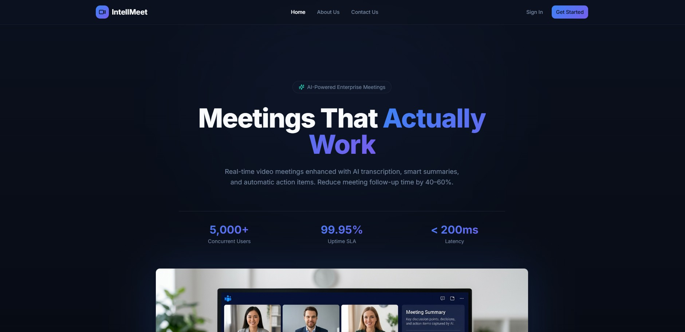

# 🚀 IntelliMeet – AI-Powered Real-Time Meeting Platform



## 📌 Overview

**IntelliMeet** is a full-stack, real-time collaboration platform designed for seamless virtual meetings. It combines secure authentication, real-time communication, video conferencing, and AI-powered insights to enhance productivity and user experience.

The platform is built using a modern scalable architecture with MERN stack, real-time technologies, and AI integrations.

---


## ✨ Key Features

### 🔐 Authentication & Security

* JWT-based authentication with refresh tokens
* Secure password hashing using bcrypt
* Protected routes with middleware
* Rate limiting to prevent brute-force attacks

---

### 👤 User Management

* User profile creation and updates
* Avatar upload (Cloudinary integration)
* Persistent user sessions

---

### 📅 Meeting Management

* Create, join, and manage meetings
* Unique meeting rooms
* Meeting history and metadata

---

### 🎥 Real-Time Video Conferencing

* WebRTC-based peer-to-peer video calls
* Audio/video controls (mute/unmute)
* Screen sharing support
* Meeting recording (planned)

---

### 💬 Real-Time Communication

* Instant chat using Socket.io
* Typing indicators
* Notifications for user activity
* Live participant presence tracking

---

### 🤖 AI-Powered Features

* Meeting transcription (Speech-to-Text)
* AI-generated meeting summaries
* Action item extraction
* Integration with AI APIs (OpenAI / Hugging Face)

---

### ⚡ Performance & Scalability

* Redis caching for sessions and meetings
* Optimized API responses
* Efficient state management

---

### 📦 DevOps & Deployment

* Docker multi-stage builds
* Kubernetes orchestration with Helm
* CI/CD pipelines using GitHub Actions
* Monitoring with Prometheus, Grafana, and Sentry

---

## 🛠 Tech Stack

### Frontend

* React (Vite + TypeScript)
* Tailwind CSS + shadcn/ui
* TanStack Query (server state)
* Zustand (client state)
* Socket.io Client

---

### Backend

* Node.js + Express.js
* MongoDB + Mongoose
* Socket.io
* WebRTC
* JWT + bcrypt

---

### AI & Integrations

* OpenAI / Hugging Face APIs
* Speech-to-Text services

---

### DevOps

* Docker
* Kubernetes
* GitHub Actions
* Prometheus + Grafana + Sentry

---

## 📁 Project Structure

```id="3a8d72"
IntelliMeet/
│
├── backend/
│   ├── controllers/
│   ├── models/
│   ├── routes/
│   ├── middleware/
│   ├── sockets/
│   └── server.js
│
├── frontend/
│   ├── src/
│   │   ├── pages/
│   │   ├── components/
│   │   ├── hooks/
│   │   ├── services/
│   │   └── store/
│
├── docker/
├── k8s/
└── README.md
```

---

## ⚙️ Installation & Setup

### 1️⃣ Clone Repository

```id="w8txa9"
git clone https://github.com/your-username/intellimeet.git
cd intellimeet
```

---

### 2️⃣ Backend Setup

```id="l7gn5w"
cd backend
npm install
```

Create `.env` file:

```id="bnf5kq"
MONGO_URI=your_mongodb_uri
JWT_SECRET=your_secret
```

Run server:

```id="mwr1m8"
npm run dev
```

---

### 3️⃣ Frontend Setup

```id="l9n2z1"
cd frontend
npm install
npm run dev
```

---

## 🌐 Usage

1. Open application:

```id="m7cb6g"
http://localhost:5173
```

2. Sign up / Login
3. Create or join a meeting
4. Start video conferencing and chat in real-time
5. View AI-generated summaries (when enabled)

---

## 🔄 API Endpoints

### Auth

* `POST /api/auth/signup`
* `POST /api/auth/login`
* `GET /api/auth/me`
* `PUT /api/auth/update`

---

### Meetings

* `POST /api/meetings`
* `GET /api/meetings`
* `DELETE /api/meetings/:id`

---

## 🔌 Real-Time Events

### Client → Server

* `joinRoom`
* `sendMessage`
* `typing`

### Server → Client

* `receiveMessage`
* `userJoined`
* `userTyping`

---

## 🚧 Future Enhancements

* Advanced WebRTC optimization (TURN/STUN servers)
* Full meeting recording & playback
* Calendar integration (Google Calendar)
* Role-based access control
* AI-powered analytics dashboard

---

## 🤝 Contributing

1. Fork the repository
2. Create a feature branch
3. Commit changes
4. Open a Pull Request

---

## 📊 Monitoring & Observability

* Logs tracking using Sentry
* Metrics visualization with Grafana
* Performance monitoring via Prometheus

---

## 📄 License

This project is developed for educational and internship purposes.

---

## 💡 Author

Developed as part of a full-stack internship project focusing on real-time systems, scalable architecture, and AI integration.

---
